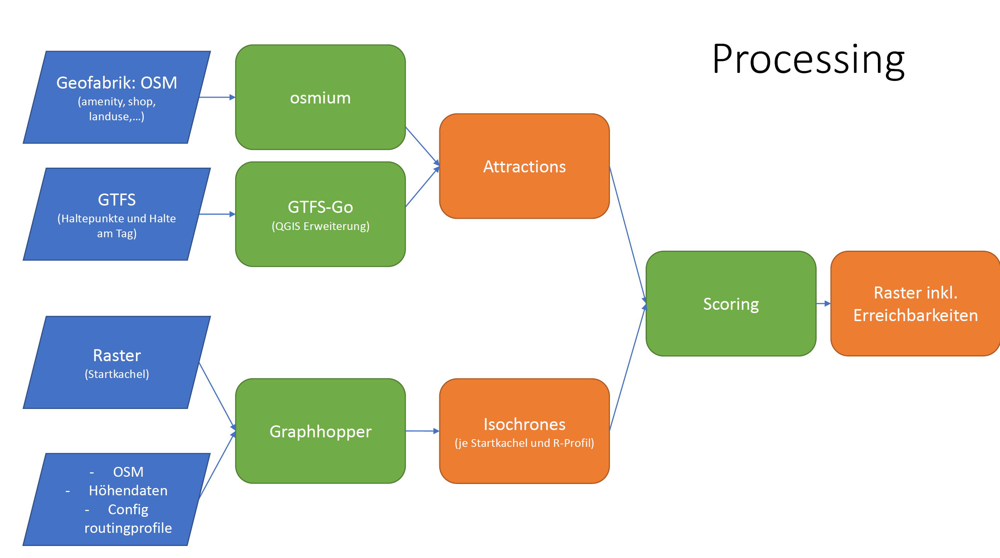

# Erreichbarad – Radverkehrsbasierte Erreichbarkeitsanalyse in ländlichen Räumen

Dieses Projekt untersucht die Erreichbarkeit mit dem Fahrrad – insbesondere in ländlichen Räumen – und stellt dafür eine modulare, datengestützte Analysepipeline bereit. Ziel ist es, den Zugang zu Alltagszielen durch den Radverkehr besser zu verstehen und die Verteilungsgerechtigkeit von Radinfrastruktur datenbasiert zu bewerten.

## Hintergrund

Der Impuls für dieses Projekt entstand durch einen Vortrag zu Erreichbarkeiten mit dem ÖPNV und zu Fuß. Daraus entwickelte sich die Frage, wie gut solche Analysen auf den Radverkehr übertragbar sind.

Das Projekt nutzt u. a. die Open-Source-Routingengine **GraphHopper**, um Isochronen für verschiedene Fahrradtypen zu berechnen und kombiniert diese mit OSM-Daten, GTFS-Fahrplandaten und Rasterdaten aus dem Zensus 2022.

## Ziele

- Routing- und Scoringprofile für Radverkehr entwickeln und vergleichen
- Erreichbarkeitsanalysen für unterschiedliche Bevölkerungsgruppen und Regionen
- Reproduzierbarer, deutschlandweit skalierbarer Analyseprozess
- Interaktive, überprüfbare Visualisierungen der Ergebnisse

## Methodik

### Routing

- Basierend auf [GraphHopper](https://www.graphhopper.com/)
- Eigene Routingprofile für:
  - Standardrad
  - E-/Lastenrad
  - "My-Bike" (fokussiert auf Nebenstraßen, vermeidet HVS)
- Integration von Höhendaten (SRTM) gegeben
- Custom Routing möglich, aber (noch) begrenzt in GH
- Erstellung von Isochronen über GH Isochrone-API

### Datenquellen

#### Attraktionen

- **OSM** (Points of Interest)
  - Verarbeitung via Osmium, ogr2ogr, geopandas
- **GTFS** (ÖPNV-Haltepunkte)
  - Aggregation mit QGIS-Erweiterung GTFS-GO

#### Startpunkte sowie Analyseflächen

- **Zensus 2022** Rasterdaten (100m)

#### GH-Routing

- OSM (Straßennetz)
- SRTM (Höhendaten)

### Verarbeitung

- Datenverarbeitung mit Python (`pandas`, `geopandas`)
- Erstellung von Isochronen über GH Isochrone-API
- Scoring je nach Attributen und Fahrzeiten

#### Prozessablauf

##### Verarbeitung erfolgt in unterschiedlichen Modulen

###### Attraktionen und Haltepunkte

- **Attraktionen aus OSM**: Extraktion und Verarbeitung von Points of Interest (POIs) aus OpenStreetMap-Daten.
- **PT Stops aus GTFS**: Aggregation und Analyse von Haltepunkten des öffentlichen Nahverkehrs basierend auf GTFS-Daten.
- **Statisches Scoring**: Bewertung von Attraktionen und Haltepunkten.

###### Routing und Isochronen

- **GH Server aufsetzen**: Einrichtung eines GraphHopper-Servers für Routinganfragen inkl custom routing Profilen.
- **Isochronenberechnung und -vereinfachung**: Erstellung von Isochronen mit der GraphHopper-Isochrone-API und anschließende Vereinfachung der Geometrien.

###### Scoring je Kachel

- **Zeitabhängiges Scoring**: Scoring auf basis der Fahrzeit als Faktor.
- **Grenznutzen**: Max. Anzahl von Attraktionen je Kathegoie werden gescored
- **Scoring**

## Visualisierung

### Interaktive Kartenbeispiele:

- [PLZ 53925](https://radverkehr.github.io/erreichbarkeiten/showcase_kall/viz/plz_53925_ebr_dash_isosimp002_25-03-21.htm)

### Erreichbarkeiten mit Standardrad

### Erreichbarkeiten mit E-/Lastenrad

### Erreichbarkeiten mit "My-Bike" (sichere Wege)

## Download

Hier kann der aktuelle Raster-Output der Verarbeitungspipeline heruntergeladen werden:

[Download germany_coeff_rasters_25-05-20.parquet](https://f003.backblazeb2.com/file/erreichbarad/germany_coeff_rasters_25-05-20.parquet)

####  Spaltenübersicht

- `GITTER_ID_100m`: ID der 100m-Rasterzelle
- `coeff_bike`, `coeff_cargo_bike`, `coeff_my_bike_cycleways`: Erreichbarkeits-Scores je Modus
- `diff_cargo_bike_abs`, `diff_my_bike_cycleways_abs`: absolute Differenz zum Basismodus (`bike`)
- `diff_cargo_bike_rel`, `diff_my_bike_cycleways_rel`: relative Differenz (verhältnismäßig)
- `plz`, `ags`, `name_23`, `RegioStaR7`: Verwaltungszuordnung
- Verschiedene Informationen aus dem Zensus 2022, z. B. Einwohnerzahlen und Bevölkerungsanteile nach Altersgruppen. Weitere Details und genaue Definitionen finden Sie im [Zensus 2022 Atlas](https://atlas.zensus2022.de/).

## Mögliche nächste Schritte

- Analyseverfahren und Zielgruppen (Routingprofile) weiterentwickeln
- Custom Routing verbessern (encoded values, road attributes erweitern)
- Scoring-Verfahren objektivieren und verfeinern
- Performance: parallele Routing-Anfragen

## Lizenz

Die verwendeten Daten stammen aus offenen Quellen (OSM, GTFS, Zensus 2022) und unterliegen den jeweiligen Lizenzbedingungen (z. B. CC-BY, Datenlizenz Deutschland – Version 2.0).

## Kontakt

[www.th-wildau.de/radverkehr](https://www.th-wildau.de/radverkehr)

---

**Hinweis**: Diese README ist vorläufig. Sie wird mit Fortschritt des Projekts und Einpflegen des Codes ergänzt.
